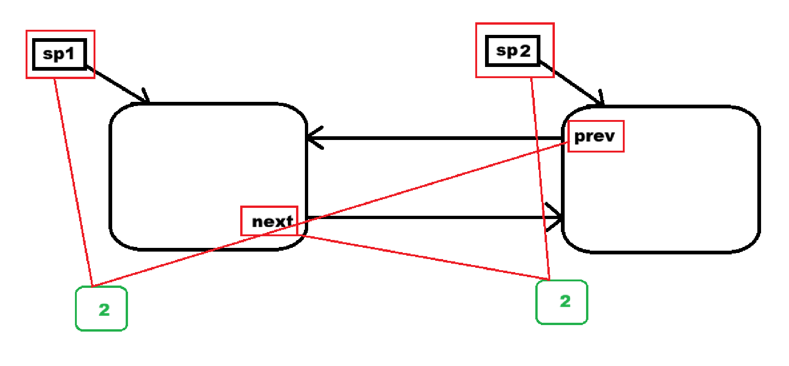

# 一、框架

```
为什么需要智能指针
        │
        ▼
     RAII思想
        │
        ▼
自己实现一个SmartPtr
        │
        ▼
四种智能指针
│
├── auto_ptr（淘汰）
├── unique_ptr（独占）
├── shared_ptr（共享）
└── weak_ptr（辅助shared_ptr）
        │
        ▼
shared_ptr底层实现
│
├── 引用计数
├── 删除器
├── make_shared
└── 线程安全
        │
        ▼
循环引用
        │
        ▼
weak_ptr解决循环引用
```

# 二、为什么要有智能指针

```cpp
int* p1 = new int[10];
int* p2 = new int[10];

Divide(a,b); // 抛异常

delete []p1;
delete []p2;
```

如果`Divide`抛异常，那么后面的`delete`就不会执行，导致内存泄漏。

# 三、RAII

RAII:Resource Acquisition Is Initialization.

> ==**资源的生命周期绑定对象生命周期。**==

# 四、具体实现smart_ptr

首先，智能指针需要一个指针：`T* _ptr;`。

当对象生命周期结束时自动释放：`~smart_ptr()`。

最后，智能指针有普通指针的所有功能。

# 五、各类智能指针

| 类型                      | 能拷贝 | 能移动 | 原理       | 推荐             |
| ------------------------- | ------ | ------ | ---------- | ---------------- |
| `auto_ptr`（C++17已移除） | ✔      | ✔      | 转移所有权 | ❌                |
| `unique_ptr`              | ❌      | ✔      | 独占资源   | ⭐⭐⭐⭐⭐            |
| `shared_ptr`              | ✔      | ✔      | 引用计数   | ⭐⭐⭐⭐⭐            |
| `weak_ptr`                | ×      | ×      | 不管理资源 | 配合`shared_ptr` |

## 1. auto_ptr

最鸡肋的智能指针，拷贝以后，原来的指针变空。

```cpp
auto_ptr<Date> p1(new Date);
auto_ptr<Date> p2(p1);
```

之后p1变空。

## 2. unique_ptr

可以移动，不能拷贝。

```cpp
unique_ptr<Date> up1(new Date);
unique_ptr<Date> up2(move(up1));
```

up2掠夺up1的资源，up1变空，`unique_ptr`可以完全替代`auto_ptr`。

## 3. shared_ptr

`shared_ptr`可以实现多个指针共同管理同一块资源，底层使用的是引用计数，记录某块资源被多少个指针指向。

例如：

```
sp1
 \
  \
   Date
  /
 /
sp2
```

还可以使用`make_shared`自动构建`shared_ptr`：

```cpp
auto sp3 = make_shared<Date>(new Date);
```

### 循环引用



这样导致两者始终无法被析构。

## 4. weak_ptr

`weak_ptr`用于解决`shared_ptr`引发的循环引用问题。它不拥有资源，不增加引用计数，不负责释放。

`weak_ptr`存在的唯一目的就是配合`shared_ptr`解决循环引用。

可以使用`expired()`查看资源是否已经释放。

# 六、实现智能指针

定制删除器：为了解决指针指向对象类型不同而无法统一使用`delete`来删除的问题。

在智能指针内部定义一个默认的`function`对象，由于删除过程较为简单，因此可以使用`lambda`来完成。

```cpp
template <class T>
class shared_ptr
{
private:
	T* _ptr;
 	int* _pcount;
    function<void(T*)> _del = [](T* ptr) {delete ptr; };
};
```

在增加一个构造方式，多传一个`function`参数表示删除器，至于这个删除器的实现可自由发挥，使用函数、仿函数、`lambda`均可。

```cpp
template<class D>
shared_ptr(T* ptr,D del)
	:_ptr(ptr),_pcount(new int(1)),_del(del)
{}
```

